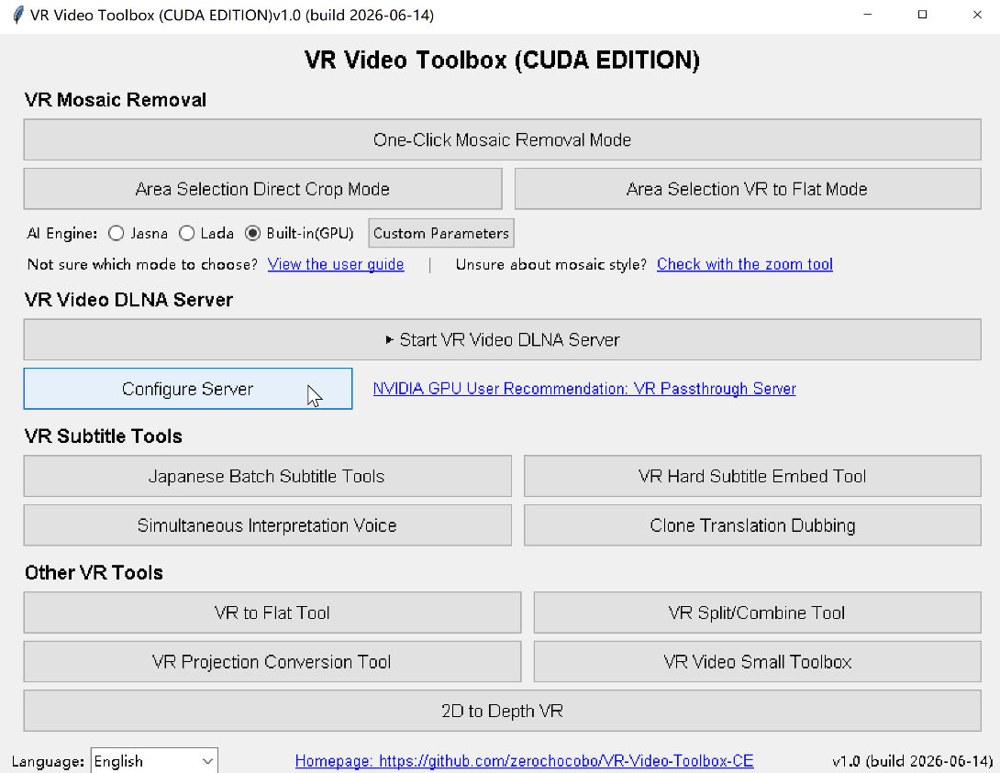

# VR Video Toolbox (CUDA EDITION) ([中文](README_CN.md) | [日本語](README_JP.md))

A Windows toolkit for VR video cleanup, subtitle work, and common VR video utilities.

The original project, https://codeberg.org/zelefans/vr_remove_mosaic, only made simple use of FFmpeg CUDA hardware acceleration, while many transform operations still had to exchange data with the CPU.

This edition is programmatically optimized for **NVIDIA CUDA**. CUDA-capable workflows use NVIDIA GPU acceleration for decoding, geometry transforms, AI processing, and encoding where supported, with FFmpeg fallback for unsupported sources or runtime environments.

Homepage: https://github.com/zerochocobo/VR-Video-Toolbox-CE

Current main features:

- Mosaic removal
- Subtitle generation, translation, and embedding
- Simultaneous interpretation (SI) voice generation and SI video audio-track mixing
- Clone translation dubbing with per-speaker voice cloning and original-vocal removal
- 2D to 3D/VR migration notice and download link for the VR Passthrough Server project
- **Lightweight LAN VR Video DLNA Server** (supports 180° SBS format auto-inducing, external subtitle auto-association, and multi-root mapping)
- VR split/combine, projection conversion, and other helper tools

Version history is available in [CHANGELOG.md](CHANGELOG.md).

The goal is to make complex video workflows usable through a GUI and batch scripts, especially for users who do not want to write FFmpeg commands by hand.

## Who This Is For

- Users who batch-process VR videos
- Users who generate, translate, or embed subtitles for VR videos
- Users who want to turn subtitles into simultaneous-interpretation audio and mix it into videos as an SI track
- Users who want to translate dialogue and create voice-cloned dubbing that replaces the original vocals while keeping music and effects
- Users looking for the migrated 2D-to-3D/VR workflow and its current download link
- Users who want to play local PC videos wirelessly on VR headsets (e.g. Oculus Quest, Pico) with player apps like Skybox and load subtitles automatically
- Users who want to try AI-assisted mosaic removal
- Users who need left/right eye splitting, merging, projection conversion, screenshots, or preview helpers



## Main Features

### 1. Mosaic Removal

Several workflows are available for different video types:

- One-click mode: the simplest choice for most common VR videos.
- Area selection direct crop mode: useful for local rectangular areas.
- Area selection VR-to-flat mode: useful when the mosaic looks square in VR view but distorted near the edges of the original frame.

#### Fisheye Options in Plain Words

The word "fisheye" appears in three places, and they are for different jobs:

- **One-Click Mode: "Convert to fisheye before processing"**
  Use this when the mosaic looks like a square/grid in the VR headset, especially with center-axis or bottom-area mosaics from studios such as SAVR/URVRSP. The tool converts each eye to a fisheye working view, runs mosaic removal, then converts the result back into the original VR projection. The final output is still a normal VR video; you do not need to run the projection converter separately.
- **Split/Combine Tool: fisheye split or fisheye combine**
  Use this only for manual workflows where you want separate left/right fisheye eye files, or where you already have restored fisheye eye files and need to combine them back into SBS VR.
- **Projection Conversion Tool: Hequirect <-> Fisheye**
  Use this when you deliberately want to convert a file's projection format. If the source is an SBS file with both eyes in one video, enable the dual-screen/SBS option so the left and right halves are converted separately and stacked back correctly.

If you are only removing mosaics, start with One-Click Mode. Enable the fisheye checkbox only when the mosaic shape calls for it; otherwise leave it off.

The final result depends heavily on the AI mosaic removal engine (`lada-cli` or `jasna`) detection and restoration quality. Complex distortion, heavy compression, or low-quality source video may produce unstable results.

> The program includes a built-in engine selector. Switch between **Lada** and **Jasna** in the main window under "AI Engine". Your choice is saved automatically.
> - Lada: https://codeberg.org/ladaapp/lada
> - Jasna (a newer maintained fork of Lada): https://github.com/Kruk2/jasna

### NVIDIA CUDA Optimization

This CUDA Edition is designed for NVIDIA GPUs. Beyond the external Lada/Jasna engines, projection conversion, left/right eye split and combine, VR-to-flat conversion, and geometry transforms in one-click workflows can use a GPU-first pipeline: PyNvVideoCodec decoding (NVDEC) -> CuPy/custom CUDA kernels -> PyNvVideoCodec encoding (NVENC). FFmpeg is still used for audio muxing and as a fallback path.

- **Backend selection**: `transcode_backend` in `vr_toolbox_config.json`
  - `auto` (default): prefer GPU and automatically fall back to FFmpeg per file when the source or runtime is unsupported.
  - `gpu`: force the CUDA path for debugging.
  - `ffmpeg`: force the original FFmpeg path.
- **10-bit / HDR**: 10-bit bt709 HEVC Main10/P010 can use the GPU path; HDR10 (PQ/smpte2084), HLG, and bt2020 wide-gamut sources fall back to FFmpeg.
- **GPU requirements**: NVIDIA GPU with NVDEC and NVENC HEVC support. Turing or newer is recommended; Ampere, Ada, or Blackwell is recommended for 10-bit work.
- **Fallback behavior**: without a compatible NVIDIA GPU or CUDA runtime, supported features fall back to FFmpeg/CPU paths where possible.

### 2. Subtitle Generation, Translation, and Embedding

Subtitle tools are included to reduce manual subtitle work:

- Generate subtitles from video audio
- Translate subtitles
- Batch subtitle processing
- Embed subtitles into VR videos
- Soft subtitle and hard subtitle related workflows

Speech recognition and translation results should still be reviewed manually, especially for names, domain-specific words, and multi-speaker dialogue.

### 3. Simultaneous Interpretation Voice

The simultaneous interpretation tool builds on Qwen3-TTS and FFmpeg:

- Convert SRT subtitles into a same-name `.si.wav` voice track with selectable language and predefined speaker voices
- Show speaker notes beside the voice selector, based on the Qwen3-TTS CustomVoice model card
- Limit a single test run to a selected time window, such as 15 seconds, 30 seconds, custom minutes, until a time point, or all subtitles
- Batch-convert subtitles paired with MP4/MKV files into `.si.wav`
- Mix `video.si.wav` into the matching MP4/MKV as an SI audio result
- Choose whether SI is overlaid on the left or right channel, set original/SI volume, and add SI delay
- Either replace the first audio track with the SI mix or add a new independent audio track named `SI`
- Batch-scan MP4/MKV files with same-name `.si.wav` sidecar files and output `_SI.mp4`

SI timing and loudness still need human review. Generated TTS may already contain translation delay, so the extra SI delay should be adjusted per source.

### 4. Clone Translation Dubbing

Clone Translation Dubbing is now a guided workflow for building a target-language voice basis, instead of only the old fully automatic pipeline:

- **Single-Speaker Clone**: for one video or a shared folder with one speaker. Transcribe and translate first, collect candidate clips, then compare the source voice, translated preview, and fixed target-language sample before confirming `SPEAKER1`.
- **Multi-Speaker Clone**: for dialogue with several speakers. Transcribe with an explicit speaker count, select/import/design a target-language basis for each speaker, export/reuse basis WAV+TXT files, or mark a speaker as `Keep original` when no cloned line should be generated for that speaker.
- **Basis voice rules**: imported basis WAV files should be 3 to 10 seconds long, the TXT must match the spoken content, and the language must be the same as the translation target. The single-speaker flow writes visible `SPEAKER1.wav` and `SPEAKER1.txt` files for review and reuse.
- **`.SI.WAV` generation**: after the basis voices are confirmed, OmniVoice synthesizes the translated dialogue into a timeline-aligned `<video>.si.wav`. A matching `<video>.si.duck.wav` is also written so remixing can lower the original audio only while cloned speech is active.
- **Legacy one-click tab**: still available for bulk automation. It can process a single file, a same-people shared folder, independent batch files, or subfolders where each subfolder shares one voice basis.
- **Mix / Dubbing tab**:
  - SI/lower-original mode keeps the original track, overlays the cloned/translated `.si.wav`, can use `.si.duck.wav` for ducking, and outputs `_SI.mp4`.
  - Dubbing mode uses Bandit-v2 to remove original vocals/dialogue, keeps the music/effects bed, mixes in the cloned voice, and outputs `_DUB.mp4`. It can also add the dub as an independent audio track.
  - The DLNA server can live-mix `[SI]` with a matching `.SI.WAV`, so a separate mixed MP4 is not always required.

The guided clone tabs require the translation API configuration used by subtitle translation. Voice cloning quality still depends on source audio quality, diarization accuracy, basis selection, and model behavior on short translated lines, so review the generated `.si.wav`, `_SI.mp4`, or `_DUB.mp4` before using them as final output.

### 5. 2D to 3D/VR

2D to 3D/VR conversion has moved to the VR Passthrough Server project. It supports real-time and offline 2D to 3D conversion with better quality and faster speed. Download it from https://wapok.com.

### 6. VR Video Utilities

The toolkit also includes common VR helpers:

- Split and combine left/right eye video, including optional fisheye eye output/input
- Convert VR video to flat preview/output
- Convert VR projection formats between hequirectangular VR and fisheye
- Take screenshots and inspect local areas
- Run batch processing scripts

### 7. VR Video DLNA Server

A highly cohesive and lightweight LAN DLNA / UPnP video streaming server:

- **Wireless VR Video Playback**: Enables VR players on the same LAN (such as Skybox VR Player in Oculus Quest, DeoVR, GizmoVR, etc.) to connect wirelessly and play videos from your PC smoothly.
- **180° SBS Format Auto-Inducing**: For 2:1 Equirectangular half-panoramic videos, the virtual filename is automatically mapped and renamed to end with `_LR_180_SBS` when browsed by clients. This perfectly induces players like Skybox to automatically render in 180° SBS 3D, avoiding tedious manual setup.
- **External Subtitle Auto-Association**: Auto-associates and prioritizes loading of external `.srt`/`.ass`/`.vtt` subtitles in the same folder, supporting prioritizing Chinese subtitles.
- **Range-supported Chunk Streaming**: Core built on FastAPI + Uvicorn, natively supports HTTP Range requests (206) for effortless, lag-free scrub/progress bar drag interactions on VR players.
- **Multi-Root Virtual Fusion**: Supports adding and removing multiple local drive video directories in the config dialog. The DLNA server will automatically merge them into a single, unified virtual tree directory structure.
- **Silent Service & Firewall Auto-pass**: Runs gracefully in a hidden background process and automatically asks for UAC permission on first run to configure Windows firewall rules for TCP 8090 and UDP 1900 SSDP.

## Recommended Usage

New users should download release file.


From the launcher, choose the tool you need:

- `One-Click Mode`: mosaic removal with minimal setup
- `Area Selection Direct Crop Mode`: local crop-based mosaic processing
- `Area Selection VR to Flat Mode`: VR-to-flat area processing
- **VR Video DLNA Server**: One-click startup/shutdown for LAN DLNA sharing, providing an independent config window for directories, port, and subtitles.
- `Japanese Batch Subtitle Tools`: subtitle generation, translation, and batch tools
- `Simultaneous Interpretation Voice`: generate `.si.wav` from subtitles and mix SI audio into MP4/MKV videos
- `Clone Translation Dubbing`: use the guided single-speaker or multi-speaker clone tabs to choose target-language basis voices, generate `<video>.si.wav`, then remix it as `_SI.mp4` or `_DUB.mp4`
- `2D to 3D/VR`: opens the migration notice for the VR Passthrough Server download
- `VR Hard Subtitle Embed Tool`: hard subtitle embedding for VR video
- Other buttons: split/combine, projection conversion, flat conversion, and small utilities

## Requirements

Recommended environment:

- Windows 10/11
- NVIDIA GPU with CUDA support. This CUDA Edition is optimized for NVIDIA CUDA and is expected to perform best on a recent NVIDIA driver.
- Python 3.10 to 3.12 for source runs
- FFmpeg
- AI mosaic removal engine (choose one):
  - **Lada CLI**: https://codeberg.org/ladaapp/lada/releases
  - **Jasna CLI**: https://github.com/Kruk2/jasna/releases

Required executables and packages:

- `ffmpeg.exe`
- `ffprobe.exe`
- `lada-cli.exe` or `jasna.exe` (choose one)
- Base Python packages: `Pillow`, `pyinstaller`, `ffmpy3`, `faster-whisper`, `numpy>=1.26,<2.1`, `auditok`, `onnxruntime-gpu`, `huggingface-hub`, `keyring`, `requests`, `transformers`, `accelerate`, `librosa`, `soundfile`, `av`, `fastapi`, `uvicorn`
- CUDA/video Python packages: `pynvvideocodec>=2.1.0`, `cupy-cuda12x>=14.0`, `nvidia-cuda-nvrtc-cu12==12.8.93`, `nvidia-cuda-runtime-cu12==12.8.90`, `nvidia-cuda-cccl-cu12>=12.9.27`
- Native AI/GPU packages: `torch==2.8.0`, `torchvision==0.23.0`, and `torchaudio==2.8.0` from the PyTorch `cu128` wheel index, plus `ultralytics==8.4.4`, `mmengine==0.10.7`, `omegaconf`, `einops`, `safetensors`, and `opencv-python`
- Translation API configuration is required for Clone Translation Dubbing transcription/translation workflows and is shared with subtitle translation settings.
- Optional/local models:
  - Qwen3-TTS 12Hz CustomVoice under `models/Qwen3-TTS-12Hz-0.6B-CustomVoice` for SI voice generation
  - OmniVoice under `models/OmniVoice` for clone translation dubbing
  - OmniVoice ECAPA under `models/OmniVoice_ECAPA` for local speaker clustering in clone translation dubbing
  - Kotoba Whisper under `models/kotoba-whisper-v2.0-faster` and/or faster-whisper models under `models/faster-whisper-*` for clone translation transcription
  - pyannote `speaker-diarization-community-1` under `models/speaker-diarization-community-1` if using pyannote diarization
  - Bandit-v2 under `models/bandit-v2` for dubbing mode vocal removal

Install Python dependencies:

```bat
cd GUI\VR_Video_Toolbox
uv sync
```

If installing manually with `pip`, keep the CUDA package versions aligned with `pyproject.toml`, and install PyTorch/torchvision/torchaudio from `https://download.pytorch.org/whl/cu128`.

FFmpeg and the AI engine (Lada or Jasna) must be discoverable by the program. You can add them to the system `PATH`, or place the executables next to the packaged app or runtime directory.

## Project Layout

```text
.
├─ GUI/
│  └─ VR_Video_Toolbox/         Main GUI application
│     ├─ one_click/             One-click mosaic removal
│     ├─ area_selection_rect_crop/
│     ├─ area_selection_vr2flat/
│     ├─ tool_subtitle/         Subtitle generation, translation, batch processing
│     ├─ tool_subembed/         VR subtitle embedding
│     ├─ tool_si/               Simultaneous interpretation voice and SI audio mixing
│     ├─ tool_clonevoice/       Clone translation dubbing and dubbing remix
│     ├─ tool_dlna/             LAN DLNA/UPnP video server
│     ├─ tool_split_combine/    VR split/combine tools
│     ├─ tool_v360_trans/       VR projection conversion
│     ├─ tool_vr2flat/          VR-to-flat tools
│     └─ tools/                 Small toolbox
├─ Scripts/
│  ├─ BatchFile(Windows)/       Windows batch scripts
│  └─ Python/                   Training, subtitle, and helper scripts
├─ Models/                      Model directory
└─ prompt/                      Work notes and handover documents
```

## Output Files

Processed files are usually written next to the input video or to the output directory selected in the tool. Common filename markers include:

- `_restored`: mosaic-processed output
- `_sbs`: side-by-side left/right eye format
- `_L` / `_R`: left-eye or right-eye video
- Subtitle tools may generate `.srt`, translated subtitle files, or videos with embedded subtitles
- SI voice tools generate `.si.wav`; SI video audio mixing outputs `_SI.mp4`
- Clone translation dubbing generates `<video>.si.wav` and `<video>.si.duck.wav`; single-speaker basis files may appear as `SPEAKER1.wav` / `SPEAKER1.txt`, and multi-speaker reusable basis files may appear as `.basis.wav` / `.basis.txt`
- Remix outputs `_SI.mp4` for SI/lower-original mode or `_DUB.mp4` for Bandit-v2 dubbing mode

Exact names depend on the selected tool and settings.

## FAQ

### Can I use it without an NVIDIA GPU?

Some video and subtitle tasks may still work, but AI-based mosaic removal usually depends on CUDA. Without a suitable GPU, performance and availability may be limited.

### Why is mosaic removal quality inconsistent?

The result depends on source quality, mosaic shape, VR projection distortion, AI engine (Lada or Jasna) capability, and selected parameters. Test a short clip first before processing a full video. You can also try switching engines (main window → AI Engine) to compare results.

### Are generated subtitles ready to publish?

Usually no. Speech recognition and machine translation can make mistakes, so manual review is recommended.

### Which mosaic removal mode should I choose?

Start with one-click mode on a short clip. If the mosaic looks square/grid-like in the headset, try the fisheye checkbox in One-Click Mode. If the mosaic looks normal in VR but strongly slanted or trapezoid-shaped in the raw PC frame, try the VR-to-flat area workflow. The zoom/inspection tool in the launcher can help identify the mosaic style.

### What should I do if the LAN DLNA server is not found or cannot be opened?

1. **Firewall Blocks**: The program will automatically ask for UAC permission to open firewall ports TCP 8090 and UDP 1900 on first launch. If blocked, please allow them in Windows Security center manually.
2. **Same LAN**: Absolutely make sure that your computer and your VR headset (like Quest/Pico) are connected to the Wi-Fi of the same router, and the router does not have AP Isolation (Access Point Isolation) enabled.
3. **Add Manually**: If SSDP broadcast is not discoverable due to router multicast restrictions, you can connect wirelessly by entering the LAN IP (shown in the main interface, e.g., `192.168.x.x:8090`) in Skybox under "Network" -> "Add manual server".

## Credits

This project builds on FFmpeg, LADA, Jasna, Whisper-related tools, and community contributions. Thanks to the open-source authors and users who report issues and share improvements.
