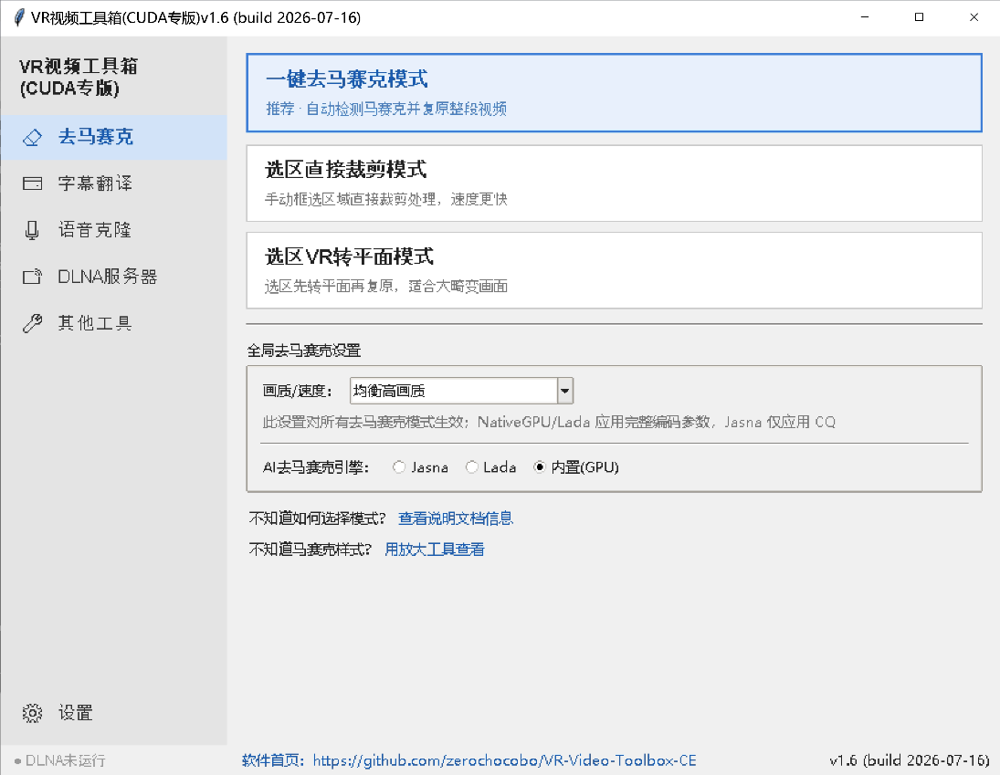

# VR视频工具箱(CUDA专版)（[English](README.md) | [日本語](README_JP.md)）

面向 VR 视频整理、修复和字幕处理的一组 Windows 工具。

原项目 https://codeberg.org/zelefans/vr_remove_mosaic 只简单利用ffmpeg的cuda硬件加速，大量变换操作还是不得不与CPU交换。

本版本针对 **NVIDIA CUDA** 程序性优化：支持的流程会优先使用 NVIDIA GPU 完成解码、几何变换、AI 处理和编码，不支持的素材或运行环境会自动回退到 FFmpeg 路径。

软件首页：https://github.com/zerochocobo/VR-Video-Toolbox-CE

整合包下载地址：

- 百度网盘：https://pan.baidu.com/s/1763ZDLEXvyHgDRq8_ZaxBw?pwd=1234
- 夸克网盘：https://pan.quark.cn/s/210f85bfdb37?pwd=QT4k

当前主要功能：

- 马赛克去除
- 字幕生成、翻译、嵌入
- 同声传译（SI）语音生成与视频 SI 音轨混合
- 按说话人音色克隆的翻译配音，并支持移除原始人声
- 2D 转 3D/VR 迁移提示，并提供 VR 透视服务器项目下载入口
- **轻量级局域网 VR 视频 DLNA 服务器**（支持 180° SBS 格式自适应诱导、外部字幕自动关联与多物理目录映射）
- VR 视频拆分、合并、投影转换等辅助工具

历史更新记录见 [CHANGELOG.md](CHANGELOG.md)。

本项目尽量把复杂的视频处理流程做成图形界面和批处理流程，适合不想手写命令的用户使用。

## 适合谁使用

- 想批量处理 VR 视频的用户
- 想给 VR 视频生成字幕、翻译字幕或嵌入字幕的用户
- 想把字幕转换成同声传译语音，并将 SI 音轨混入视频的用户
- 想翻译对白、克隆原视频中不同说话人音色，并在保留音乐音效的同时替换原始人声的用户
- 想了解已迁移的 2D 转 3D/VR 流程，并获取当前下载入口的用户
- 想要在 VR 头显（如 Quest/Pico）中用 Skybox 等播放器直接无线播放电脑本地视频并自动关联字幕的用户
- 想尝试用 AI 工具去除视频马赛克的用户
- 想拆分左右眼、合并视频、转换 VR 投影格式的用户

请只处理你有权处理的视频内容，并遵守所在地法律法规。



## 主要功能

### 1. 马赛克去除

提供多种处理方式，适配不同类型的 VR 视频：

- 一键模式：适合多数常见 VR 视频，操作最简单。
- 选区直接裁剪模式：适合画面中局部矩形区域的处理。
- 选区 VR 转平面模式：适合在 VR 视角中更接近方形、但原始画面边缘发生变形的马赛克。

#### 普通用户该怎么理解“鱼眼”

软件里有三个地方会出现“鱼眼”，用途并不一样：

- **一键模式里的“去马赛克前先转换成鱼眼视角”**
  这是去马赛克用的处理开关。适合在 VR 眼镜里看起来像正方形/网格的马赛克，尤其是 SAVR、URVRSP 等中轴或底部区域马赛克。程序会把左右眼临时转成鱼眼视角，完成识别和修复后再转回原本的 VR 投影；最终成品仍然是正常 VR 视频，不需要再手动跑一次投影转换。
- **VR 拆分/合并工具里的鱼眼选项**
  只适合手动流程：例如你想把原片拆成左右眼鱼眼文件，或手里已经有修复好的左右眼鱼眼文件，需要合并回 SBS VR 视频。
- **VR 投影转换工具里的“VR半球 <-> 鱼眼”**
  这是单独改视频投影格式的工具。只有在你确实需要得到鱼眼文件，或需要把鱼眼文件转回 VR 半球时才使用。如果源文件是左右眼同屏的 SBS 视频，请勾选双屏/SBS 选项，让程序分别转换左右半边后再正确拼回去。

如果只是去马赛克，新用户优先用一键模式；只有马赛克形态需要时才勾选鱼眼开关，否则保持关闭。

处理效果主要受 AI 去马赛克引擎（`lada-cli` 或 `jasna`）的识别和修复能力影响。对于复杂变形、遮挡严重或画质很差的视频，结果可能不稳定。

> 程序内置引擎选择器，可在主界面的「AI去马赛克引擎」中切换 **Lada** 和 **Jasna**，选择会自动记忆。
> - Lada：https://codeberg.org/ladaapp/lada
> - Jasna（Lada 的新一代维护分支）：https://github.com/Kruk2/jasna

### NVIDIA CUDA 优化（纯显卡处理流水线）

本软件针对 **NVIDIA CUDA** 做了专门优化。除 lada/jasna 去马赛克本身外，VR 投影转换、左右眼拆分/合并、VR 转平面、一键流程中的几何变换均已改为 **纯显卡处理**：PyNvVideoCodec 解码（NVDEC）→ CuPy/自定义 kernel 几何变换 → PyNvVideoCodec 编码（NVENC），ffmpeg 仅用于复用音频。相比原先的 CPU `v360` 滤镜，8K 素材端到端可达约 2.5–3× 提速，几何结果与 ffmpeg 一致（裸像素 PSNR ~62–79dB）。

- **后端选择**：配置项 `transcode_backend`（`vr_toolbox_config.json`）
  - `auto`（默认）：优先 GPU，遇不支持的源或运行时异常自动逐文件回退 ffmpeg。
  - `gpu`：强制 GPU（调试用，不回退）。
  - `ffmpeg`：强制走原 ffmpeg 路径。
- **10-bit / HDR**：10-bit bt709（HEVC Main10/P010）走 GPU 真 10-bit 保真；HDR10（PQ/smpte2084）、HLG、bt2020 宽色域自动回退 ffmpeg。
- **GPU 要求**：支持 NVDEC+NVENC HEVC 的 NVIDIA 显卡（Turing 及以后，10-bit 建议 Ampere/Ada/Blackwell）；需较新驱动。当前源码环境按 CUDA 12.8 Python wheel 对齐（`cupy-cuda12x` + `nvidia-cuda-* cu12`，通过 PTX JIT 支持 Blackwell sm_120）。
- 无可用 GPU 时整体自动降级为 ffmpeg 模式，功能不受影响（仅速度较低）。

### 2. 字幕生成、翻译、嵌入

字幕工具用于减少手工整理字幕的工作量：

- 从视频中提取语音并生成字幕
- 字幕翻译
- 批量字幕处理
- 将字幕嵌入 VR 视频
- 软字幕或硬字幕相关处理

字幕识别和翻译结果仍建议人工检查，尤其是人名、专有名词和多人对话场景。

### 3. 同声传译语音

同声传译语音工具基于 Qwen3-TTS 和 FFmpeg：

- 将 SRT 字幕转换成同名 `.si.wav` 语音文件，可选择语言和预设音色
- 在音色选择右侧显示 speaker 特点备注，备注参考 Qwen3-TTS CustomVoice 模型页说明
- 单文件测试可限制处理时间，如 15 秒、30 秒、自定义分钟、直到指定时间点或全部字幕
- 批量将与 MP4/MKV 同名的字幕转换成 `.si.wav`
- 将 `video.si.wav` 混入同名 MP4/MKV，生成 SI 视频音频结果
- 可选择叠加到左声道或右声道，并设置原声音量、SI 音量和 SI 延迟
- 可选择替换第一条音轨，或新增一条名为 `SI` 的独立音轨
- 可批量扫描带有同名 `.si.wav` 旁路文件的 MP4/MKV，输出 `_SI.mp4`

SI 的同步和响度仍建议人工试听校对。部分 TTS 结果本身已经包含翻译延迟，此时额外 SI 延迟需要按素材调整。

### 4. 克隆翻译配音

克隆翻译配音现在是「先选好目标语言参考音色，再生成配音」的引导式流程，不再只是旧版全自动一键流程：

- **单人语音克隆**：适合单个视频或同一目录里只有一个说话人的素材。先转录并翻译，再抽取候选片段；候选列表可试听原声、翻译预览和固定目标语言样本，最后确认 `SPEAKER1`。
- **多人语音克隆**：适合多人对白。先指定说话人数并完成转录/分离，再为每个说话人选择候选、导入 WAV+TXT、用 OmniVoice 设计音色，或导出/复用参考音色；不想配音的说话人可设为「保留原声」，该说话人不会生成克隆语音。
- **参考音色规则**：导入的参考 WAV 建议 3 到 10 秒，TXT 必须和语音内容一致，并且语言必须和翻译目标语言一致。单人流程会生成可见的 `SPEAKER1.wav` 和 `SPEAKER1.txt`，方便检查和复用。
- **生成 `.SI.WAV`**：确认参考音色后，OmniVoice 会把翻译对白合成为按时间线对齐的 `<视频名>.si.wav`；同时生成 `<视频名>.si.duck.wav`，用于回混时只在克隆语音出现的时间压低原声。
- **旧版一键克隆页**：仍保留给批量自动流程，可处理单文件、同一文件夹共享同一组人物音色、批量独立处理，或按子文件夹分别共享音色。
- **混音配音页**：
  - 压低原声模式：保留原音轨，叠加克隆/翻译后的 `.si.wav`，可用 `.si.duck.wav` 控制压低原声的时间，输出 `_SI.mp4`。
  - 移除原始人声模式：用 Bandit-v2 去掉原始对白/人声，保留音乐和音效背景，再混入克隆语音，输出 `_DUB.mp4`，也可把配音作为独立音轨加入。
  - DLNA 服务器可以在直播流 `[SI]` 中直接混入同名 `.SI.WAV`，不一定需要先生成混音 MP4。

引导式克隆流程需要配置字幕翻译共用的翻译 API。克隆配音质量仍受源音频质量、说话人分离准确度、参考音色选择，以及模型对短翻译句的表现影响；正式使用前建议人工试听 `.si.wav`、`_SI.mp4` 或 `_DUB.mp4`。

### 5. 2D 转 3D/VR

2D 转 3D/VR 功能已经迁移到 VR 透视服务器项目。新项目支持实时和离线 2D 转 3D，转换效果更好、速度更快，请访问 https://wapok.com 下载。

### 6. VR 视频辅助工具

项目还包含一些常用小工具：

- VR 左右眼拆分与合并，并支持可选的鱼眼左右眼输入/输出
- VR 转平面预览或输出
- VR 半球与鱼眼之间的投影格式转换
- 视频截图、局部放大检查等辅助功能
- 批量处理脚本

### 7. VR 视频 DLNA 服务器

一个高内聚、轻量级的局域网 DLNA / UPnP 视频流媒体服务器：

- **VR 视频无线播放**：让同一局域网内的 VR 视频播放器（如 Oculus Quest 中的 Skybox VR 播放器、DeoVR、GizmoVR 等）能够无线连接并直接流畅点播电脑中的视频。
- **180° SBS 格式自适应诱导**：针对 2:1 等距柱状（Equirectangular）的半全景视频，在客户端浏览时自动将虚拟文件名映射重命名为以 `_LR_180_SBS` 结尾，完美诱导 Skybox 等播放器智能自适应渲染，免去手动繁琐调节。
- **外部字幕自动关联**：支持一键开关，自动且优先为播放端关联并排序加载同名目录下的 `.srt`/`.ass`/`.vtt` 外挂中英文字幕文件，支持中文权重优先。
- **流媒体切片 Range 播放**：核心基于 FastAPI + Uvicorn 运行，完美支持 HTTP 字节切片 Range 播放响应（206），保证 VR 终端内进度条任意拖拽播放极其丝滑。
- **多磁盘物理目录虚拟融聚**：支持在配置窗口中添加和删除多个不同的本地磁盘物理目录，DLNA 端将自动融合并整合成统一的虚拟目录层级进行展示。
- **独立服务与防火墙一键通过**：以独立隐藏的后台进程优雅拉起，并在首次启动时自动通过 UAC 申请权限打通 Windows 防火墙 TCP 8090 与 UDP 1900 规则，保证运行无阻。

## 推荐使用方式

新用户建议优先使用图形界面：

```bat
cd GUI\VR_Video_Toolbox
run.bat
```

如果 `run.bat` 无法启动，也可以使用：

```bat
cd GUI\VR_Video_Toolbox
python main.py
```

打开后，在主界面选择需要的工具：

- `One-Click Mode`：一键去马赛克
- `Area Selection Direct Crop Mode`：选区直接裁剪处理
- `Area Selection VR to Flat Mode`：VR 转平面选区处理
- **VR 视频 DLNA 服务器**：一键开启/停止局域网 DLNA 共享，提供独立的配置窗口（管理共享目录、端口及字幕关联）
- `日语批量字幕工具`：字幕生成与翻译相关工具
- `同声传译语音`：从字幕生成 `.si.wav`，并将 SI 音频混入 MP4/MKV 视频
- `克隆翻译配音`：用单人或多人引导式流程选择目标语言参考音色，生成 `<视频名>.si.wav`，再回混为 `_SI.mp4` 或 `_DUB.mp4`
- `2D转3D/VR`：打开 VR 透视服务器下载提示
- `VR Hard Subtitle Embed Tool`：VR 硬字幕嵌入
- 其他按钮：VR 拆分合并、投影转换、小工具箱

## 运行环境

推荐环境：

- Windows 10/11
- NVIDIA 显卡，支持 CUDA。本 CUDA 专版针对 NVIDIA CUDA 优化，建议使用较新的 NVIDIA 驱动。
- Python 3.10 到 3.12（源码运行环境）
- FFmpeg
- AI 去马赛克引擎（二选一）：
  - **Lada CLI**：https://codeberg.org/ladaapp/lada/releases
  - **Jasna CLI**（推荐尝试）：https://github.com/Kruk2/jasna/releases

基础依赖：

- `ffmpeg.exe`
- `ffprobe.exe`
- `lada-cli.exe` 或 `jasna.exe`（二选一）
- 基础 Python 包：`Pillow`、`pyinstaller`、`ffmpy3`、`faster-whisper`、`numpy>=1.26,<2.1`、`auditok`、`onnxruntime-gpu`、`huggingface-hub`、`keyring`、`requests`、`transformers`、`accelerate`、`librosa`、`soundfile`、`av`、`fastapi`、`uvicorn`
- CUDA/视频 Python 包：`pynvvideocodec>=2.1.0`、`cupy-cuda12x>=14.0`、`nvidia-cuda-nvrtc-cu12==12.8.93`、`nvidia-cuda-runtime-cu12==12.8.90`、`nvidia-cuda-cccl-cu12>=12.9.27`
- 内置 AI/GPU 包：`torch==2.8.0`、`torchvision==0.23.0` 和 `torchaudio==2.8.0`（来自 PyTorch `cu128` wheel 源），以及 `ultralytics==8.4.4`、`mmengine==0.10.7`、`omegaconf`、`einops`、`safetensors`、`opencv-python`
- 克隆翻译配音的转录/翻译流程需要配置翻译 API，该配置与字幕翻译共用。
- 可选/本地模型：
  - 同声传译语音需要将 Qwen3-TTS 12Hz CustomVoice 放到 `models/Qwen3-TTS-12Hz-0.6B-CustomVoice`
  - 克隆翻译配音需要将 OmniVoice 放到 `models/OmniVoice`
  - 克隆翻译配音的本地说话人聚类需要将 OmniVoice ECAPA 放到 `models/OmniVoice_ECAPA`
  - 克隆翻译配音的转录可使用 `models/kotoba-whisper-v2.0-faster` 下的 Kotoba Whisper，或 `models/faster-whisper-*` 下的 faster-whisper 模型
  - 如使用 pyannote 说话人分离，需要将 `speaker-diarization-community-1` 放到 `models/speaker-diarization-community-1`
  - 配音模式移除原始人声需要将 Bandit-v2 放到 `models/bandit-v2`

Python 依赖安装：

```bat
cd GUI\VR_Video_Toolbox
uv sync
```

如果手动用 `pip` 安装，请以 `pyproject.toml` 中的版本为准，并从 `https://download.pytorch.org/whl/cu128` 安装 PyTorch / torchvision / torchaudio。

FFmpeg 和 AI 引擎（Lada / Jasna）需要能被程序找到。可以放到系统 `PATH` 中，也可以在打包版或运行目录旁边放置相关可执行文件。

## 项目目录

```text
.
├─ GUI/
│  └─ VR_Video_Toolbox/         图形界面主程序
│     ├─ one_click/             一键去马赛克
│     ├─ area_selection_rect_crop/
│     ├─ area_selection_vr2flat/
│     ├─ tool_subtitle/         字幕生成、翻译、批量处理
│     ├─ tool_subembed/         VR 字幕嵌入
│     ├─ tool_si/               同声传译语音与 SI 音轨混合
│     ├─ tool_clonevoice/       克隆翻译配音与配音回混
│     ├─ tool_dlna/             局域网 DLNA/UPnP 视频服务器
│     ├─ tool_split_combine/    VR 拆分与合并
│     ├─ tool_v360_trans/       VR 投影转换
│     ├─ tool_vr2flat/          VR 转平面
│     └─ tools/                 小工具箱
├─ Scripts/
│  ├─ BatchFile(Windows)/       Windows 批处理脚本
│  └─ Python/                   训练、字幕等 Python 脚本
├─ Models/                      模型目录
└─ prompt/                      工作记录与交接文档
```

## 输出文件

处理后的文件通常会生成在输入视频所在目录或工具指定的输出目录中。常见命名包括：

- `_restored`：马赛克处理后的文件
- `_sbs`：左右眼并排格式
- `_L` / `_R`：左眼或右眼视频
- 字幕工具会根据任务生成 `.srt`、翻译后的字幕文件或嵌入字幕后的视频
- 同声传译语音工具会生成 `.si.wav`；混合 SI 视频音轨会输出 `_SI.mp4`
- 克隆翻译配音会生成 `<视频名>.si.wav` 和 `<视频名>.si.duck.wav`；单人参考音色可能生成 `SPEAKER1.wav` / `SPEAKER1.txt`，多人可复用参考音色可能生成 `.basis.wav` / `.basis.txt`
- 回混后，压低原声/SI 模式输出 `_SI.mp4`，Bandit-v2 配音模式输出 `_DUB.mp4`

实际命名以所选工具界面提示为准。

## 常见问题

### 没有 NVIDIA 显卡可以用吗？

部分视频和字幕流程可能可以运行，但马赛克去除依赖的 AI 处理通常需要 CUDA 环境。没有合适显卡时，速度和可用性都会受到明显影响。

### 为什么去马赛克效果不稳定？

效果取决于原视频清晰度、马赛克形态、VR 投影变形、AI 引擎（Lada / Jasna）能力和参数选择。建议先截取短片段测试，再批量处理完整视频。也可尝试切换引擎（主界面 → AI去马赛克引擎）对比效果。

### 字幕结果能直接发布吗？

不建议直接发布未校对结果。语音识别和机器翻译都可能出错，最好人工检查一遍。

### 我该选哪个去马赛克模式？

不知道选哪个时，先用一键模式测试短片段。如果在 VR 眼镜里看马赛克像正方形/网格，尝试勾选一键模式里的鱼眼开关。如果 VR 里看正常、但在电脑原始画面里明显变成梯形或斜边形，再尝试 VR 转平面选区模式。主界面中的放大检查工具可以帮助判断马赛克形态。

### 局域网 DLNA 服务器搜不到或搜到打不开怎么办？

1. **防火墙阻挡**：程序会在首次启动时自动通过 UAC 权限开启防火墙端口 TCP 8090 和 UDP 1900。如果拦截，请手动在 Windows 安全中心放行相关端口。
2. **同一局域网**：请绝对确保电脑和您的 VR 眼镜（如 Quest/Pico）连接在同一个路由器的 Wi-Fi 局域网下，且路由器未开启 AP 隔离（Access Point Isolation）功能。
3. **手动添加**：如果 SSDP 广播因为路由器多播限制搜不到，可以在 Skybox 播放器中通过“网络” -> “手动添加服务” -> 输入局域网 IP（主界面上显示的 LAN IP，如 `192.168.x.x:8090`）来进行无线连接。

## 致谢

本项目依赖 FFmpeg、LADA、Jasna、Whisper 相关工具以及社区贡献。感谢所有开源项目作者和反馈问题、提交改进的用户。
