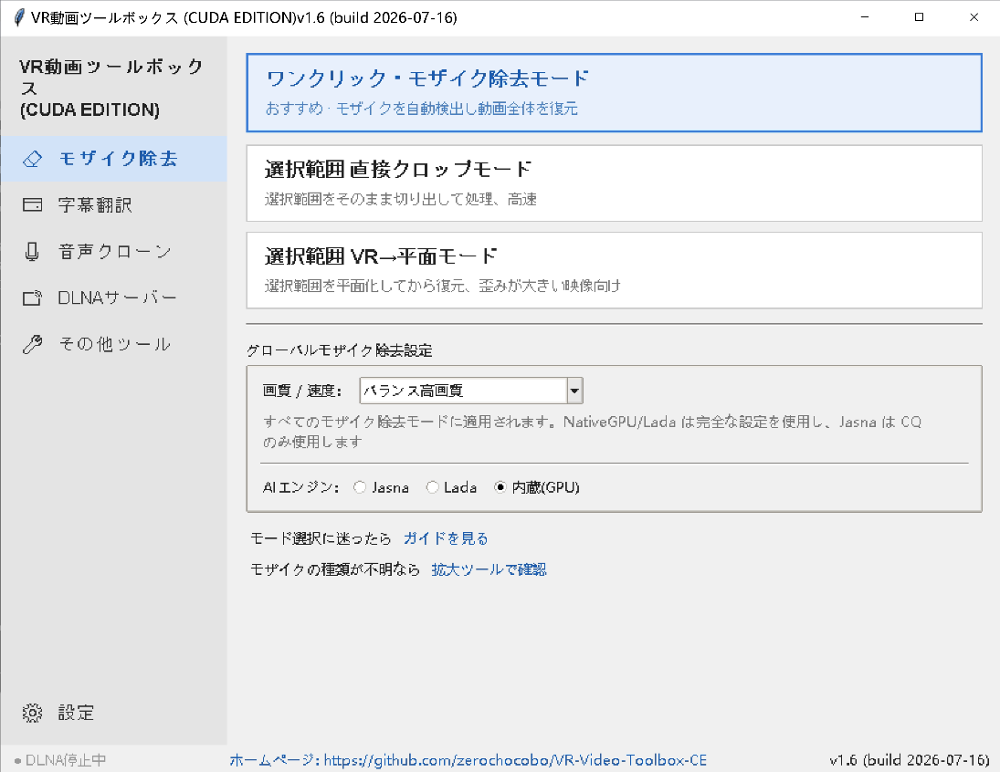

# VR動画ツールボックス (CUDA EDITION)（[English](README.md) | [中文说明](README_CN.md)）

VRビデオの整理、修復、および字幕処理向けに設計されたWindows用ツールキットです。

元プロジェクト https://codeberg.org/zelefans/vr_remove_mosaic は FFmpeg の CUDA ハードウェアアクセラレーションを簡易的に利用するだけで、多くの変換処理では依然として CPU とのデータ交換が必要でした。

本バージョンは **NVIDIA CUDA** 向けにプログラムレベルで最適化されています。対応するワークフローでは、NVIDIA GPU によるデコード、ジオメトリ変換、AI処理、エンコードを優先し、未対応のソースや実行環境では FFmpeg 経路へフォールバックします。

ホームページ：https://github.com/zerochocobo/VR-Video-Toolbox-CE

現在の主な機能：

- モザイク除去
- 字幕生成・翻訳・埋め込み
- 同時通訳（SI）音声生成と動画 SI 音声トラックのミックス
- 話者ごとの音声クローンによる翻訳吹き替えと元ボーカル除去
- 2Dから3D/VR 機能の移行案内と、VR動画透視サーバープロジェクトへのダウンロードリンク
- **軽量ローカルLAN向け VRビデオDLNAサーバー**（180° SBSフォーマット自動誘導、外部字幕自動読み込み、マルチディレクトリマッピング対応）
- VRビデオ分割・結合、投影変換などのアシストツール

更新履歴は [CHANGELOG.md](CHANGELOG.md) をご覧ください。

本プロジェクトは、複雑なビデオ処理プロセスをグラフィカルインターフェース（GUI）やバッチ処理にカプセル化し、コマンドを手書きしたくない一般ユーザー向けに設計されています。

## 対象ユーザー

- VRビデオをバッチ処理したいユーザー
- VRビデオに字幕を生成、翻訳、または動画内に埋め込みたいユーザー
- 字幕から同時通訳音声を作成し、SI 音声トラックとして動画にミックスしたいユーザー
- セリフを翻訳し、元動画の各話者の声をクローンして、音楽や効果音を残したまま元の声を置き換えたいユーザー
- 移行済みの 2Dから3D/VR ワークフローと現在のダウンロード先を確認したいユーザー
- VRゴーグル（QuestやPicoなど）のSkyboxなどのプレイヤーを使って、PC内の動画をワイヤレスで直接再生し、外部字幕を自動で読み込ませたいユーザー
- AIツールを用いたビデオのモザイク除去を試したいユーザー
- 左右のステレオ映像の分割・結合、VR投影フォーマットの変換を行いたいユーザー

ご自身が処理する権限を持つビデオのみを処理し、現地の法規を遵守してください。



## 主な機能

### 1. モザイク除去

異なるタイプのVRビデオに適応するため、複数の処理モードを提供しています：

- ワンクリックモード：ほとんどの一般的なVRビデオに適した、最も簡単な操作モード。
- 選択範囲直接クロップモード：画面内の局所的な矩形領域の処理に適しています。
- 選択範囲 VRから平面変換モード：VR視野内では正方形に近く見えるが、元の映像のエッジで歪みが生じているモザイクの処理に適しています。

#### 「魚眼」オプションの使い分け

本ソフトでは「魚眼」という言葉が3か所に出てきますが、用途はそれぞれ異なります：

- **ワンクリックモードの「先に魚眼視点へ変換」**
  モザイク除去用の処理オプションです。VRゴーグル内でモザイクが正方形/グリッド状に見える場合、特に SAVR や URVRSP などの中央軸・画面下部のモザイクで試します。左右の映像を一時的に魚眼の作業ビューへ変換し、モザイク除去後に元のVR投影へ戻します。最終出力は通常のVR動画なので、別途投影変換を実行する必要はありません。
- **分割/結合ツールの魚眼オプション**
  手動ワークフロー向けです。元動画から左右別々の魚眼ファイルを作りたい場合、または復元済みの左右魚眼ファイルを SBS VR 動画へ結合したい場合に使います。
- **投影変換ツールの「半球 <-> 魚眼」**
  動画ファイルの投影形式を明示的に変換するためのツールです。魚眼ファイルを作成したい場合、または魚眼ファイルを半球VRへ戻したい場合に使います。左右が1本に入った SBS 動画では、dual-screen/SBS オプションを有効にして、左右を別々に変換してから正しく結合してください。

モザイク除去だけが目的なら、まずワンクリックモードを使ってください。魚眼チェックは、モザイク形状が合う場合だけ有効にします。

処理結果は主にAIモザイク除去エンジン（`lada-cli` または `jasna-cli`）の識別および修復能力に依存します。複雑な歪み、激しい遮蔽、または画質が非常に悪いビデオの場合、結果が不安定になることがあります。

> プログラムにはエンジンセレクターが内蔵されており、メイン画面の「AIモザイク除去エンジン」で **Lada** と **Jasna** を切り替えることができます。選択は自動的に保存されます。
> - Lada：https://codeberg.org/ladaapp/lada
> - Jasna（Ladaの次世代メンテナンスブランチ）：https://github.com/Kruk2/jasna

### NVIDIA CUDA 最適化

この CUDA EDITION は NVIDIA GPU 向けに設計されています。外部の Lada/Jasna エンジンに加えて、VR投影変換、左右映像の分割・結合、VRから平面への変換、ワンクリック処理内のジオメトリ変換では、GPU優先パイプラインを使用できます：PyNvVideoCodec デコード（NVDEC）→ CuPy/カスタム CUDA kernel → PyNvVideoCodec エンコード（NVENC）。FFmpeg は主に音声の多重化とフォールバック経路に使用されます。

- **バックエンド選択**：`vr_toolbox_config.json` の `transcode_backend`
  - `auto`（既定）：GPUを優先し、ソースや実行時環境が未対応の場合はファイル単位で FFmpeg に自動フォールバックします。
  - `gpu`：デバッグ用に CUDA 経路を強制します。
  - `ffmpeg`：従来の FFmpeg 経路を強制します。
- **10-bit / HDR**：10-bit bt709 HEVC Main10/P010 は GPU 経路を使用できます。HDR10（PQ/smpte2084）、HLG、bt2020 広色域ソースは FFmpeg にフォールバックします。
- **GPU要件**：NVDEC + NVENC HEVC に対応する NVIDIA GPU。Turing 以降を推奨し、10-bit処理には Ampere / Ada / Blackwell を推奨します。
- **フォールバック**：互換性のある NVIDIA GPU または CUDA ランタイムがない場合、対応機能は可能な範囲で FFmpeg/CPU 経路へ切り替わります。

### 2. 字幕生成・翻訳・埋め込み

手動での字幕整理の手間を大幅に削減します：

- ビデオの音声から高精度に文字起こしし、字幕を生成
- 字幕翻訳
- 字幕のバッチ処理
- 字幕をVRビデオ内にハードコード（焼き付け）埋め込み
- ソフト字幕またはハード字幕関連の処理

音声認識と翻訳の結果は、特に人名、専門用語、複数人の会話シーンなどにおいて、手動での確認を推奨します。

### 3. 同時通訳音声

同時通訳音声ツールは Qwen3-TTS と FFmpeg を利用します：

- SRT字幕から同名の `.si.wav` 音声ファイルを生成し、言語とプリセット話者を選択できます
- 話者選択の右側に、Qwen3-TTS CustomVoice モデルカードに基づく話者特徴メモを表示します
- 単体テストでは、15秒、30秒、指定分数、指定時刻まで、または全字幕などの処理時間を選択できます
- MP4/MKV と同名の字幕を一括で `.si.wav` に変換できます
- `video.si.wav` を同名の MP4/MKV にミックスして SI 音声付き動画を生成できます
- SI を左チャンネルまたは右チャンネルに重ね、原音量、SI音量、SI遅延を調整できます
- 最初の音声トラックを置き換えるか、`SI` という独立音声トラックを追加するかを選択できます
- 同名 `.si.wav` サイドカーファイルを持つ MP4/MKV を一括スキャンし、`_SI.mp4` を出力できます

SI の同期と音量バランスは、必ず試聴して確認してください。生成済み TTS に翻訳遅延が含まれている場合、追加の SI 遅延は素材ごとに調整が必要です。

### 4. クローン翻訳吹き替え

クローン翻訳吹き替えは、現在はターゲット言語の基準音声を確認してから吹き替え音声を作るガイド式ワークフローです。旧来の全自動一括処理だけではありません：

- **単一話者音声クローン**：1本の動画、または同じフォルダ内に1人分の声だけがある素材向けです。先に文字起こしと翻訳を行い、候補クリップを抽出します。候補一覧では原音、翻訳プレビュー、固定ターゲット言語サンプルを聴き比べてから `SPEAKER1` を確定します。
- **複数話者音声クローン**：複数人の会話向けです。話者数を指定して文字起こし・話者分離を行い、話者ごとに候補を選ぶ、WAV+TXT を取り込む、OmniVoice で音色を設計する、基準音声を書き出して再利用する、といった操作ができます。吹き替え不要の話者は「原音を保持」にでき、その話者のクローン音声は生成されません。
- **基準音声の条件**：取り込む基準 WAV は 3〜10 秒程度、TXT は実際の発話内容と一致し、言語は翻訳先言語と同じである必要があります。単一話者フローでは確認用に `SPEAKER1.wav` と `SPEAKER1.txt` が見える形で保存されます。
- **`.SI.WAV` 生成**：基準音声を確定すると、OmniVoice が翻訳済みセリフをタイムラインに合わせて `<動画名>.si.wav` として合成します。同時に `<動画名>.si.duck.wav` も作成され、再ミックス時にクローン音声のある時間だけ原音を下げられます。
- **旧一括クローンタブ**：自動処理用として残っています。単一ファイル、同じ人物構成のフォルダ共有、ファイルごとの独立一括処理、サブフォルダごとの共有基準音声に対応します。
- **ミックス/吹き替えタブ**：
  - 原音を下げる/SI モードでは、元音声を残してクローン翻訳 `.si.wav` を重ね、必要に応じて `.si.duck.wav` でダッキングし、`_SI.mp4` を出力します。
  - 吹き替えモードでは Bandit-v2 で元の声やセリフを除去し、音楽・効果音の背景を残してクローン音声を混ぜ、`_DUB.mp4` を出力します。独立音声トラックとして追加することもできます。
  - DLNA サーバーでは、同名の `.SI.WAV` をライブストリーム `[SI]` に直接ミックスできるため、必ずしも事前にミックス済み MP4 を作る必要はありません。

ガイド式クローン機能には、字幕翻訳と共通の翻訳 API 設定が必要です。音声クローンの品質は、元音声の品質、話者分離の精度、基準音声の選択、短い翻訳文に対するモデル挙動に左右されます。最終出力として使う前に、生成された `.si.wav`、`_SI.mp4`、`_DUB.mp4` を確認してください。

### 5. 2Dから3D/VR

2Dから3D/VR機能はVR動画透視サーバープロジェクトへ移行しました。新しいプロジェクトはリアルタイムおよびオフラインの2Dから3D変換に対応し、より高品質で高速に変換できます。https://wapok.com からダウンロードしてください。

### 6. VRビデオ DLNAサーバー

非常に高機能で軽量なローカルLAN内向けの DLNA / UPnP ビデオストリーミングサーバーです：

- **VRビデオワイヤレス再生**：同一LAN内のVRビデオプレイヤー（Oculus QuestのSkybox VR Player、DeoVR、GizmoVRなど）からPC内の動画を直接スムーズにワイヤレス点播・再生できます。
- **180° SBSフォーマット自動誘導**：2:1のアスペクト比を持つ正距円筒図法（Equirectangular）の半天球ビデオについて、クライアントがブラウジングする際、仮想ファイル名を自動的に `_LR_180_SBS` で終わるようにマッピングし、Skyboxなどのプレイヤーが自動的に180° SBS 3Dステレオレンダリングモードを選択するようシームレスに誘導します。
- **外部字幕の自動関連付け**：ワンクリックでオン/オフを切り替え可能。動画と同じフォルダ内にある同名の `.srt` / `.ass` / `.vtt` 外部字幕ファイルを自動的かつ優先的に関連付けてロードします（日本語・中国語の優先重み付け対応）。
- **Range対応チャンクストリーミング**：FastAPI + Uvicornをコアに構築されており、HTTP Rangeリクエスト（206）をネイティブにサポート。VRプレイヤー内でのシークやタイムラインのドラッグ操作も極めて滑らかで引っかかりがありません。
- **仮想フォルダ融合マッピング**：設定画面からローカルディスクの異なる複数のビデオ物理ディレクトリを追加または削除可能。DLNAクライアント側では自動的にマージされ、1つの統一された仮想ツリーディレクトリ階層として整然と表示されます。
- **サイレント起動＆ファイアウォール自動開放**：完全に非表示のバックグラウンドプロセスとしてスマートに立ち上がります。初回起動時には自動的にUAC（ユーザーアカウント制御）特権をリクエストし、WindowsファイアウォールのTCP 8090およびUDP 1900 SSDPルールを安全に開放します。

### 7. VRビデオ共通ユーティリティ

その他にも実用的な小ツールが搭載されています：

- VR 左右ステレオ映像の分割と結合（必要に応じて魚眼の左右映像を出力/入力可能）
- VR映像の平面プレビューおよび変換出力
- 半球VRと魚眼の投影フォーマット相互変換
- スクリーンショット撮影、局所拡大検査などのアシスト機能
- バッチ処理スクリプト

## 推奨される使用方法

新規ユーザーはグラフィカルインターフェース（GUI）の使用を強く推奨します：

```bat
cd GUI\VR_Video_Toolbox
run.bat
```

もし `run.bat` で起動できない場合は、以下を実行してください：

```bat
cd GUI\VR_Video_Toolbox
python main.py
```

ランチャーが開いたら、用途に合わせてツールを選択します：

- `One-Click Mode`：最小限の設定でワンクリックモザイク除去
- `Area Selection Direct Crop Mode`：局所的なクロップによるモザイク処理
- `Area Selection VR to Flat Mode`：VRから平面への変換選択範囲処理
- **VR Video DLNA Server**：ワンクリックでLAN DLNA共有を開始/停止。共有ディレクトリ、ポート、字幕ロードを管理する専用設定画面付き。
- `日本語一括字幕ツール`：字幕生成、翻訳、およびバッチツール
- `同時翻訳音声`：字幕から `.si.wav` を生成し、SI 音声を MP4/MKV 動画へミックス
- `クローン翻訳吹き替え`：単一話者または複数話者のガイド式フローでターゲット言語の基準音声を選び、`<動画名>.si.wav` を生成して `_SI.mp4` または `_DUB.mp4` に再ミックス
- `2Dから3D/VR`：VR動画透視サーバーのダウンロード案内を表示
- `VR Hard Subtitle Embed Tool`：VRビデオへの字幕のハードコード埋め込み
- その他のボタン：分割/結合、投影変換、平面変換、小ツール箱

## 動作環境

推奨環境：

- Windows 10/11
- CUDAをサポートするNVIDIAグラフィックカード。本 CUDA EDITION は NVIDIA CUDA 向けに最適化されており、新しい NVIDIA ドライバーを推奨します。
- Python 3.10 から 3.12（ソース実行時）
- FFmpeg
- AIモザイク除去エンジン（いずれか一つ）：
  - **Lada CLI**：https://codeberg.org/ladaapp/lada/releases
  - **Jasna CLI**：https://github.com/Kruk2/jasna/releases

必須となる実行ファイルおよびパッケージ：

- `ffmpeg.exe`
- `ffprobe.exe`
- `lada-cli.exe` または `jasna-cli.exe`（いずれか一つ）
- 基本 Python パッケージ：`Pillow`、`pyinstaller`、`ffmpy3`、`faster-whisper`、`numpy>=1.26,<2.1`、`auditok`、`onnxruntime-gpu`、`huggingface-hub`、`keyring`、`requests`、`transformers`、`accelerate`、`librosa`、`soundfile`、`av`、`fastapi`、`uvicorn`
- CUDA/ビデオ Python パッケージ：`pynvvideocodec>=2.1.0`、`cupy-cuda12x>=14.0`、`nvidia-cuda-nvrtc-cu12==12.8.93`、`nvidia-cuda-runtime-cu12==12.8.90`、`nvidia-cuda-cccl-cu12>=12.9.27`
- 内蔵 AI/GPU パッケージ：PyTorch `cu128` wheel インデックスの `torch==2.8.0`、`torchvision==0.23.0`、`torchaudio==2.8.0`、および `ultralytics==8.4.4`、`mmengine==0.10.7`、`omegaconf`、`einops`、`safetensors`、`opencv-python`
- クローン翻訳吹き替えの文字起こし・翻訳ワークフローには、字幕翻訳と共通の翻訳 API 設定が必要です
- 任意/ローカルモデル：
  - SI音声生成には Qwen3-TTS 12Hz CustomVoice を `models/Qwen3-TTS-12Hz-0.6B-CustomVoice` に配置します
  - クローン翻訳吹き替えには OmniVoice を `models/OmniVoice` に配置します
  - クローン翻訳吹き替えのローカル話者クラスタリングには OmniVoice ECAPA を `models/OmniVoice_ECAPA` に配置します
  - クローン翻訳吹き替えの文字起こしには `models/kotoba-whisper-v2.0-faster` の Kotoba Whisper、または `models/faster-whisper-*` の faster-whisper モデルを使用できます
  - pyannote 話者分離を使う場合は `speaker-diarization-community-1` を `models/speaker-diarization-community-1` に配置します
  - 吹き替えモードで元の声を除去するには Bandit-v2 を `models/bandit-v2` に配置します

Python依存パッケージのインストール：

```bat
cd GUI\VR_Video_Toolbox
uv sync
```

`pip` で手動インストールする場合は、CUDA 関連パッケージのバージョンを `pyproject.toml` と一致させ、PyTorch / torchvision / torchaudio は `https://download.pytorch.org/whl/cu128` からインストールしてください。

FFmpegおよびAIエンジン（Lada/Jasna）はプログラムから検出可能である必要があります。システムの環境変数 `PATH` に追加するか、パッケージ化されたアプリまたは実行ディレクトリの直下に実行ファイルを配置してください。

## プロジェクト構成

```text
.
├─ GUI/
│  └─ VR_Video_Toolbox/         GUIメインプログラム
│     ├─ one_click/             ワンクリックモザイク除去
│     ├─ area_selection_rect_crop/
│     ├─ area_selection_vr2flat/
│     ├─ tool_subtitle/         字幕生成、翻訳、バッチ処理
│     ├─ tool_subembed/         VR字幕埋め込み
│     ├─ tool_si/               同時通訳音声と SI 音声ミックス
│     ├─ tool_clonevoice/       クローン翻訳吹き替えと吹き替え再ミックス
│     ├─ tool_dlna/             LAN内 DLNA/UPnP ビデオサーバー
│     ├─ tool_split_combine/    VR映像ステレオ分割・結合
│     ├─ tool_v360_trans/       VR投影フォーマット変換
│     ├─ tool_vr2flat/          VR平面変換
│     └─ tools/                 小ツール箱
├─ Scripts/
│  ├─ BatchFile(Windows)/       Windowsバッチスクリプト
│  └─ Python/                   学習、字幕等のPythonスクリプト
├─ Models/                      モデルディレクトリ
└─ prompt/                      作業記録および引き継ぎドキュメント
```

## 出力ファイル

処理後のファイルは、通常、入力ビデオと同じディレクトリまたはツールで選択した出力ディレクトリに生成されます。一般的な命名規則は以下の通りです：

- `_restored`：モザイク処理後の動画
- `_sbs`：左右ステレオSide-by-Side動画
- `_L` / `_R`：左目用または右目用の動画
- 字幕ツールは、タスクに応じて `.srt`、翻訳された字幕ファイル、または字幕が埋め込まれたビデオを生成します。
- 同時通訳音声ツールは `.si.wav` を生成し、SI 動画音声ミックスは `_SI.mp4` を出力します
- クローン翻訳吹き替えは `<動画名>.si.wav` と `<動画名>.si.duck.wav` を生成します。単一話者の基準音声は `SPEAKER1.wav` / `SPEAKER1.txt`、複数話者の再利用用基準音声は `.basis.wav` / `.basis.txt` として保存される場合があります
- 再ミックス後は、原音を下げる/SI モードで `_SI.mp4`、Bandit-v2 吹き替えモードで `_DUB.mp4` を出力します

正確な名称は、選択したツールと設定に依存します。

## よくある質問 (FAQ)

### NVIDIAグラフィックカードがなくても使えますか？

一部のビデオや字幕文字起こしプロセスは動作する可能性がありますが、AIによるモザイク除去は通常CUDA（NVIDIA GPU）環境を必要とします。適切なGPUがない場合、処理速度や利用可能性が大幅に制限されます。

### モザイク除去の効果が不安定なのはなぜですか？

効果は、元のビデオの鮮明さ、モザイクの形状、VR投影の歪み、AIエンジン（Lada / Jasna）の実力、および選択されたパラメータに依存します。フルビデオを処理する前に、まずは短いクリップでテストすることを推奨します。メイン画面でエンジンを切り替えて結果を比較することも可能です。

### 生成された字幕をそのまま公開できますか？

校正していない結果をそのまま公開することは推奨しません。音声認識や機械翻訳は誤りを犯す可能性があるため、手動で一度確認することをお勧めします。

### どのモザイク除去モードを選べばよいですか？

まずはワンクリックモードで短い動画をテストしてください。VRゴーグル内でモザイクが正方形/グリッド状に見える場合は、ワンクリックモードの魚眼チェックを試してください。VR内では自然に見えるのに、PC上の元フレームでは台形や斜め形状に大きく歪んでいる場合は、VRから平面への範囲選択モードを試します。ランチャー内の「拡大検査ツール」を使うと、モザイクの形状や種類を判別しやすくなります。

### ローカルのDLNAサーバーが見つからない、または開けない場合は？

1. **ファイアウォールによる遮断**：プログラムは初回起動時に自動的にUAC特権を求め、ファイアウォールポート TCP 8090 および UDP 1900 を開放します。もしブロックされた場合は、Windows セキュリティセンターから手動で許可してください。
2. **同一LAN環境**：PCとVRゴーグル（QuestやPicoなど）が**同じルーターのWi-Fiローカルネットワーク**に接続されていることを絶対に確認してください。また、ルーターの「プライバシーセパレータ（AP分離）」機能が有効になっていないことを確認してください。
3. **手動追加**：ルーターのマルチキャスト制限などによりSSDP自動検出が機能しない場合は、Skyboxプレイヤーの「ネットワーク」->「手動でサーバーを追加」から、メイン画面に表示されているLAN IP（例：`192.168.x.x:8090`）を直接入力してワイヤレス接続できます。

## 謝辞

本プロジェクトは、FFmpeg、LADA、Jasna、Whisper関連ツール、およびコミュニティの多大な貢献の上に構築されています。オープンソースプロジェクトの作者、およびバグ報告や改善を提案してくださるすべてのユーザーに感謝いたします。
